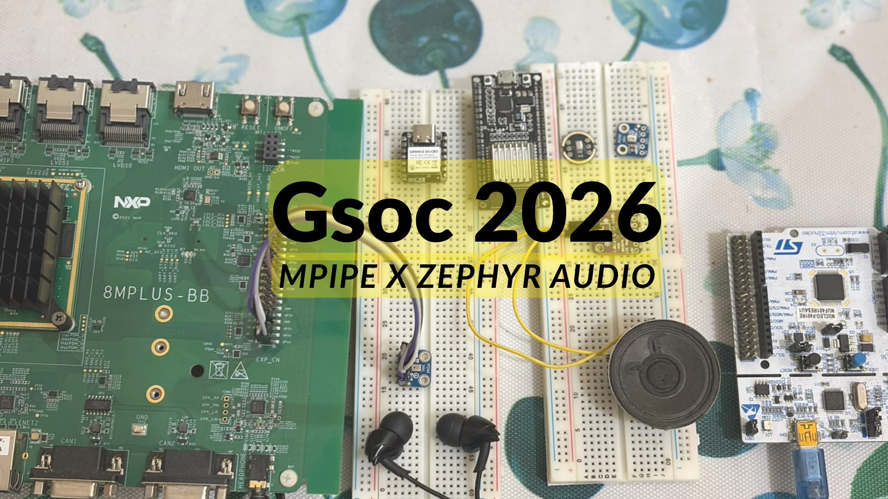

# GSoC 2026 Final Report: Extending and Validating mpipe Audio in Zephyr

| | |
| Contributor | Mohit Talwar |
| Organization | The Linux Foundation : [Zephyr Project](https://www.zephyrproject.org/) |
| Program | Google Summer of Code 2026 |
| Mentors and technical guidance | Iulia Prodan, Phi Bang Nguyen, and Tomas Barak |

## Project overview

This project extended Zephyr's new Multimedia Pipeline [mpipe](https://github.com/zephyrproject-rtos/zephyr/pull/98514) audio support from an existing DMIC-to-I2S demonstration into a more reusable, measurable, and hardware-tested audio path. The main functional addition is a generic I2S source element, accompanied by a single loopback sample that can select either DMIC or I2S capture. The work also covered capability and buffer negotiation, stream lifecycle and error recovery, audio-driver and board enablement, and reusable latency instrumentation.

This project does not fit into a single pull request or one upstream contribution. It addresses several smaller issues across multiple subsystems: from NXP clock support and MCUX SAI to I2S and nRF audio drivers, helping make Zephyr’s overall audio infrastructure more stable, portable, and dependable.

Hardware validation became a major part of the project because a pipeline is only as portable as the drivers beneath it. The same graph exposed different DMA, clocking, ownership, and stop/restart behavior on NXP, Nordic, Espressif, and STM32 platforms. The resulting driver and integration work is therefore a first-class project output, not only test scaffolding.

The original scope also included optional extensions. One stretch goal produced an i.MX8MP Cortex-M7-to-HiFi4 audio and TinyML prototype. Its architecture and earlier hardware evidence are documented, but it remains an integration prototype pending final revalidation and upstream API work.

## Goals and completion status

| Goal | Status | Outcome |
| --- | --- | --- |
| Finalize the existing DMIC → gain → I2S pipeline | **Completed** | The sample was updated for the current mpipe APIs, lifecycle behavior was hardened, documentation and tests were expanded, and native simulation remained part of the validation path. |
| Implement a generic I2S source | **Completed; upstream review in progress** | The new source discovers device capabilities, negotiates a format and buffer pool, supports an optional capture codec, and handles stop/replay. It is proposed in [PR #114261](https://github.com/zephyrproject-rtos/zephyr/pull/114261). |
| Provide reference loopback pipelines | **Completed for validated configurations** | One `audio_loopback` sample supports DMIC → gain → I2S, I2S → gain → I2S, and native-simulation workflows. It is proposed in [PR #114262](https://github.com/zephyrproject-rtos/zephyr/pull/114262). I also worked slightly on file_src --> i2s_sink although it is not a part of this sample. |
| Characterize performance and latency | **Completed** | Reusable software-transit and acoustic-loopback instrumentation was implemented and tested on i.MX8MP. The corrected results distinguish software time, pool occupancy, handoff cadence, and physical round-trip latency. |
| Validate multiple platforms | **Completed** | i.MX8MP, nRF52840, NUCLEO-F401RE and ESP32 are all hardware-tested. `native_sim` and four further NXP targets are build-tested. |
| Demonstrate TinyML in the pipeline | **Prototype completed** | A zero-copy cross-core M7-to-HiFi4 audio path reached on-device inference. It is not upstream-ready and will be re-tested before final figures and branch links are published. |
| USB audio and RTIO/`net_buf` migration | **Deferred** | These remained stretch or longer-term items so that the core audio path, hardening, measurements, and hardware validation could be completed first. |

## Executive summary

The foundational [mpipe core PR #98514](https://github.com/zephyrproject-rtos/zephyr/pull/98514) merged on September 16, 2026. The base, utility, audio-plugin, and original audio-sample layers are still under review, so the I2S-source and unified-loopback pull requests remain stacked drafts rather than independently mergeable changes. This is an upstream dependency state, not an indication that the work is abandoned: the core only just landed, and the remaining layers can now be reviewed and rebased in dependency order.

Within that stack, this project added the generic I2S capture path and the common sample, fixed lifecycle and audio-processing problems, implemented exact buffer-demand accounting, and developed the driver and board support needed to exercise the work on real devices. The strongest hardware results are the i.MX8MP EVK and XIAO nRF52840 Sense paths. ESP32 has a working but not yet publication-final integration state, while STM32 is deliberately marked as work in progress.

## Main contributions

### 1. Generic I2S source and unified loopback sample

The existing audio work had a DMIC source and an I2S sink but no generic way to bring captured I2S data into an mpipe graph. I implemented an `i2s_src` element derived from the mpipe source base class. It queries the I2S controller through the audio `get_caps` interface, optionally intersects those results with a capture codec, configures the selected stream, reads DMA-completed blocks, and transfers ownership into the graph. Capture is started only when the pipeline enters `PLAYING`, rather than as a side effect of configuration, and stop/replay leaves the element reusable.

The companion sample was reorganized as `audio_loopback` instead of remaining tied to one input type. At build time, the same application can select a DMIC or I2S source and connect it through the gain element to the common I2S sink. This preserves a small reference graph while covering microphone capture, analog-codec capture, processing, and playback. The sink was also made usable without a codec, which is necessary for codec-less I2S endpoints and native simulation.

### 2. Capability negotiation

Hard-coding one known-good PCM configuration would have hidden the main portability problem. Instead, each audio endpoint reports its supported sample-rate mask, bit widths, channel range, frame-interval range, and layout. When a codec is present, the source or sink intersects the controller and codec capabilities. The gain transform constrains the widths and layouts that it can process while passing compatible rate, channel, and interval choices through the graph.

The source enumerates candidate formats, and mpipe propagates each candidate downstream until the entire graph accepts one. A caps filter can pin a requested format; otherwise the graph chooses from the common set. Native-simulation coverage includes combinations such as 16-bit/48-kHz and 32-bit/96-kHz, while real hardware remains bounded by its controller, clocks, and codec. For example, the WM8960 path used for i.MX8MP validation is limited to the formats that the physical codec and board clocking can realize.

This work also made capability discovery part of platform enablement. Drivers that had never needed to describe their audio constraints required `get_caps` implementations, and board-specific clock assumptions had to be made visible rather than left as accidental behavior.

### 3. Buffer negotiation and ownership

Audio DMA drivers retain multiple blocks at once: capture may own queued and active buffers while playback simultaneously holds a prime set and transmit queue. A shared heap-free pool therefore cannot be sized from the largest single request. Those demands coexist.

After format negotiation determines the exact PCM block size, the source initiates an allocation query. The source's driver-reported minimum, one in-flight pipeline block, and the downstream demand are added to produce the required pool count. Transforms forward or combine pool requirements, and the sink reports the blocks needed for its driver queue and start prime. The final slab is configured only after both block size and count are known. This replaced arbitrary padding with a contract derived from the graph and its drivers.

Correct counting matters because exhaustion is only one possible failure. Reinitializing a slab while a driver still owns blocks can corrupt its free list on the next start. That exact disagreement appeared on nRF52840: the NXP DMIC driver returned its queued blocks on stop, while the Nordic PDM driver did not. Fixing the driver ownership contract made repeated stop/replay reliable and established a reusable debugging rule: compare two implementations of the same API when only one platform fails.

### 4. Lifecycle, EOF, and recovery hardening

The framework and base sink already provide the normal end-of-stream route, so the work focused on the places where real audio drivers violate the assumptions of a clean simulation. Source threads now start without a resume race. I2S capture and playback begin only in `PLAYING`; pause and stop are treated as distinct transitions; and a read that reports the queue drained after an intentional stop is translated into a pipeline flush rather than a fatal stream error. Full stop/replay reuses the element instead of tearing down the application.

On playback, an underrun no longer has to destroy the graph. The sink can issue the driver's recovery transition, re-prime the transmitter, and continue, dropping a bounded amount of audio rather than leaving the pipeline permanently failed. The nRF path additionally returns PDM blocks still queued at stop and drops capture blocks under temporary downstream pressure instead of halting capture forever. Tests and hardware cycles cover play, pause, resume, stop, replay, forced transmit stalls, and stop while buffers are queued.

Several smaller fixes were necessary to make those paths trustworthy: the dummy codec now accepts the formats it is intended to model, 16-bit gain above unity is clamped without integer overflow, queue bounds are explicit in simulation, and the sample distinguishes driver failures from expected flushing. This is why the project treats hardening as part of the contribution rather than an afterthought to the new element.

### 5. Cross-platform driver and board enablement

Platform validation required substantial work below mpipe. On NXP i.MX8MP, the audio graph depends on cyclic SDMA behavior, an MCUX SAI implementation using the Zephyr DMA API, M7 audio-clock and AudioMix ownership, MICFIL configuration, WM8960 capture/duplex behavior, devicetree wiring, and a board integration layer. The design keeps the SDMA controller owned by the Zephyr DMA driver instead of privately claiming it through an MCUX-only path, allowing the engine to remain shareable. Issue [#117960](https://github.com/zephyrproject-rtos/zephyr/issues/117960) records the remaining SAI/SDMA design and upstream coordination.

On the XIAO nRF52840 Sense, the port added I2S and PDM capability reporting, correct PDM stop/drain behavior, recoverable pressure handling, a selectable I2S master-clock frequency, and sample board files for the on-board microphone plus external amplifier. Hardware testing exposed a rate mismatch even though both peripherals were derived from the same oscillator; choosing compatible divider settings removed the steady accumulation and capture drops.

On the NUCLEO-F401RE, the port added I2S capability reporting, a channel length independent of word size for microphones needing 64 bit clocks, recoverable handling of an empty slab or full queue, and a PDM driver that reports capabilities, sizes its own block, answers the full trigger set, and decimates one stream per microphone rather than per requested channel. The player matrix passed on hardware; audibility is not yet established.

The ESP32 integration runs the same DMIC to gain to I2S graph on hardware. Its memory figure was not recorded alongside the others, and its capability reporting and exact final revision still need confirming before the branch is split into PRs.

### 6. Latency instrumentation and measurement

I added default-off instrumentation that timestamps a buffer as it leaves a source and accumulates the time when it reaches the sink. This measures mpipe software transit only. A separate counter records pool blocks in use at the handoff, and another records handoff cadence; neither is relabeled as physical latency.

For an end-to-end result, a diagnostic acoustic probe emits a known burst, detects its return through the microphone, compensates for the first matching sample's position within the captured block, and restores live audio after success or a bounded timeout. The probe uses the graph's negotiated sample width and measures its quiet floor only after the output has settled. This separation produced repeatable and explainable software and physical measurements instead of one ambiguous number.

### 7. Cortex-M7 to HiFi4 IPC and TinyML stretch goal

The stretch prototype splits the application across the i.MX8MP Cortex-M7 and HiFi4 DSP. The M7 captures audio, negotiates the graph, preserves the local monitor path, and publishes audio buffers through an IPC sink backed by shared DDR. The DSP consumes those buffers through an externally driven IPC source, copies samples into bounded inference windows, and runs the `micro_speech` model outside the M7's real-time audio path.

## Code contributions and upstream status

Upstream state in this table was rechecked on September 17, 2026. A pull request that contains carried commits is not presented as wholly authored by this project.

| Contribution | Link or exact revision | Attribution | State |
| --- | --- | --- | --- |
| mpipe core | [PR #98514](https://github.com/zephyrproject-rtos/zephyr/pull/98514) | Dependency by Phi Bang Nguyen | **Merged** September 16, 2026 |
| mpipe base plugin | [PR #111526](https://github.com/zephyrproject-rtos/zephyr/pull/111526) | Dependency by Phi Bang Nguyen | **Open** |
| mpipe utilities | [PR #114477](https://github.com/zephyrproject-rtos/zephyr/pull/114477) | Dependency by Phi Bang Nguyen | **Merged** |
| Generic I2S source and audio fixes | [PR #114261](https://github.com/zephyrproject-rtos/zephyr/pull/114261), current head [`52c159b15ab1`](https://github.com/zephyrproject-rtos/zephyr/commit/52c159b15ab18780cd05024f3b0fcdde11401aa2) | Mohit Talwar's commits stacked on the dependencies above | **Open draft; CI passing** |
| Unified audio-loopback sample and lifecycle work | [PR #114262](https://github.com/zephyrproject-rtos/zephyr/pull/114262), current head [`b01c5667f0aa`](https://github.com/zephyrproject-rtos/zephyr/commit/b01c5667f0aac4eb944a708e18cc32bae65b1d2e) | Mohit Talwar's changes plus Michal Chvatal's preserved original sample commit and the dependency stack | **Open draft; CI passing** |
| mpipe player-controlled lifecycle and replay | [PR #114262](https://github.com/zephyrproject-rtos/zephyr/pull/114262) | Mohit Talwar's sample and element lifecycle fixes use Phi Bang Nguyen's mpipe player utility | **Hardware-tested on NXP and nRF; open draft** |
| NXP i.MX8MP driver and board series | [Issue #117960](https://github.com/zephyrproject-rtos/zephyr/issues/117960); [`gsoc/evk-imx8mp-integration-final`](https://github.com/mohittalwar23/zephyr/tree/gsoc/evk-imx8mp-integration-final) at `a730906a1f6` | Mohit Talwar's integration and proposed driver changes; dependent on existing NXP drivers and HAL | **Hardware-tested integration; split upstreaming pending** |
| nRF52840 driver and board series | [`gsoc/nrf-integration`](https://github.com/mohittalwar23/zephyr/tree/gsoc/nrf-integration) at `3f58dd3c1e3b` | Mohit Talwar's driver and board changes on carried mpipe/audio dependencies | **Published; hardware-tested before the rebase** |
| STM32 NUCLEO-F401RE driver and board series | [`gsoc/stm32-integration`](https://github.com/mohittalwar23/zephyr/tree/gsoc/stm32-integration) at `320f96c4958` | Mohit Talwar | **Published; player matrix passed on hardware** |
| ESP32 integration | [`gsoc/esp32-audio`](https://github.com/mohittalwar23/zephyr/tree/gsoc/esp32-audio) at `b4fcd864b9e` | Mohit Talwar | **Hardware-tested; PR split pending** |
| Latency instrumentation | `work/mpipe-latency-final`, local only | Mohit Talwar | **Hardware-tested; not yet published** |
| M7 to HiFi4 IPC and TinyML prototype | [`gsoc/imx8mp-m7-hifi4-ipc`](https://github.com/mohittalwar23/zephyr/tree/gsoc/imx8mp-m7-hifi4-ipc) at `ce2cf83f228` | Mohit Talwar, derived from active IPC and inference work by their original authors | **Published; hardware-validated, upstream review closed** |

## Platform validation and test results

| Platform | Validated path | Lifecycle and stress result | Performance or memory result | Known limitation |
| --- | --- | --- | --- | --- |
| NXP i.MX8MP EVK, Cortex-M7 | On-board DMIC → gain → SAI/WM8960; WM8960 capture → gain → SAI/WM8960 | Pause/play, stop/play, replay, DMIC and I2S soaks, transmit recovery, and final `PLAYING` state were exercised without runtime warnings in the recorded final sessions. | DMIC software transit 5 µs; I2S transit 2 µs; acoustic round trip summarized below. | The driver/clock/HAL stack still needs to be split and reviewed upstream; the physical codec constrains real formats. |
| XIAO nRF52840 Sense | On-board PDM microphone → gain → I2S/MAX98357A | 12 lifecycle cycles, 10 forced underrun recoveries, six stall-then-stop cycles, and a 180-second soak passed; no dropped blocks occurred in the post-clock-fix soak. | Whole debug image: 114.5 KiB flash and 43.8 KiB RAM. Approximate audio-pipeline share: 13 KiB flash and 16 KiB RAM. | The generic audio API reports nominal formats, not every hardware divider's exact realized rate; the integration uses matched clock settings. |
| ESP32 | DMIC → gain → I2S loopback | Hardware-tested | - | Memory figure not recorded. Driver capability reporting and the exact final integration revision still need confirming. |
| STM32 NUCLEO-F401RE | PDM microphone → gain → I2S/MAX98357A; INMP441 I2S capture on the same graph | 17 player cycles (12 then 5 across a reset), 80 s soak, 0 log errors; `mp34dt01@0`, `i2s2`, `i2s3` and `dma1` all READY. | PDM build 130,564 B flash and 95,441 B RAM (**97.1 %**); I2S build 124,892 B and 34,457 B. | Audibility not established. A single 49,152-byte lookup table in `hal_st`'s `OpenPDMFilter.c` cannot be disabled from Zephyr; the board browns out when the amplifier drives a speaker from 3V3. |
| `native_sim` | Simulated capture → gain → simulated I2S | Capability, lifecycle, teardown, and source/sink tests are exercised in the pull-request and local Twister suites; current PR CI is passing. | Negotiation covers, among other cases, 16-bit/48-kHz and 32-bit/96-kHz combinations. | Simulation validates contracts and fault paths, not board clocks, DMA, codecs, or acoustics. |
| Additional NXP build targets | RT685, RT595, RT1170, and MCX N5xx sample configurations | Clean builds in the documented matrix. | No hardware runtime figure claimed. | Build success must not be read as physical validation. |

**Status (September 19, 2026):** the STM32 session ran and its results are in the table above. Every figure in this section comes from a recorded run on the stated hardware; build-only and simulated results are labelled as such.

### Corrected latency results

The measurements below describe different boundaries and must not be added together.

| Measurement | Minimum | Mean | Maximum | Samples | Boundary |
| --- | ---: | ---: | ---: | ---: | --- |
| DMIC software transit | 5 µs | 5 µs | 5 µs | 4,255 | Source push to sink handoff inside mpipe |
| I2S software transit | 2 µs | 2 µs | 2 µs | 4,637 | Source push to sink handoff inside mpipe |
| Acoustic round trip | 19.371 ms | 19.396 ms | 19.434 ms | 5 | Speaker output through the acoustic and capture path back to detection |

The stream used a 10,000-microsecond negotiated frame interval, and its mean handoff period was 9,999 microseconds. Pool utilization was recorded separately as a pressure diagnostic. It is a count of simultaneously allocated blocks, including blocks held by drivers, and not a latency value and not an average queueing delay. The physical result came from five fixed-placement trials; their 63-microsecond spread corresponds to two samples at 32 kHz.

## Current project state

**The goal is stable audio code merged in the places it belongs:** the mpipe
subsystem, the audio and I2S drivers of four vendors, and the boards that use
them. Against that, where things stand:

### Merged upstream

- [mpipe core, PR #98514](https://github.com/zephyrproject-rtos/zephyr/pull/98514). Merged 16 September 2026.
- [mpipe utilities, PR #114477](https://github.com/zephyrproject-rtos/zephyr/pull/114477). Merged. This is the player that the lifecycle work drives.

### Open upstream, CI passing

- [PR #114261](https://github.com/zephyrproject-rtos/zephyr/pull/114261): generic I2S source and audio fixes.
- [PR #114262](https://github.com/zephyrproject-rtos/zephyr/pull/114262): unified loopback sample and lifecycle work.
- [PR #114263](https://github.com/zephyrproject-rtos/zephyr/pull/114263): `codec_dummy` start/stop output.
- [PR #111526](https://github.com/zephyrproject-rtos/zephyr/pull/111526): mpipe base plugin, a dependency rather than this project's work.

### Published on the fork, hardware-tested, not yet split into PRs

| Branch | Head | State |
| --- | --- | --- |
| [`gsoc/evk-imx8mp-integration-final`](https://github.com/mohittalwar23/zephyr/tree/gsoc/evk-imx8mp-integration-final) | `a730906a1f6` | i.MX8MP EVK, full stack; both capture paths audible |
| [`gsoc/nrf-integration`](https://github.com/mohittalwar23/zephyr/tree/gsoc/nrf-integration) | `3f58dd3c1e3b` | XIAO nRF52840; matrix passed before the rebase onto current `main` |
| [`gsoc/stm32-integration`](https://github.com/mohittalwar23/zephyr/tree/gsoc/stm32-integration) | `320f96c4958` | NUCLEO-F401RE; 16 hardware-found driver fixes |
| [`gsoc/imx8mp-m7-hifi4-ipc`](https://github.com/mohittalwar23/zephyr/tree/gsoc/imx8mp-m7-hifi4-ipc) | `ce2cf83f228` | M7 to HiFi4 cross-core pipeline with TinyML |
| [`gsoc/esp32-audio`](https://github.com/mohittalwar23/zephyr/tree/gsoc/esp32-audio) | `b4fcd864b9e` | ESP32 DMIC to I2S loopback; hardware-tested |

### Validated on silicon

- **i.MX8MP EVK**: both capture paths audible; full player matrix, 0 warnings. Coexists with SOF: an A/B run with and without this series is identical, 0 xruns, both audibly clean.
- **XIAO nRF52840**: 12 lifecycle cycles, 10 forced underrun recoveries, 6 stall-then-stop, 180 s soak, no dropped blocks.
- **NUCLEO-F401RE**: 17 player cycles across a reset, 80 s soak, 0 log errors.
- **M7 to HiFi4**: one pipeline spanning two cores; 139 inference windows, 0 buffers dropped; peer restart tears down to `DOWN` without rebuilding.
- **ESP32**: DMIC to gain to I2S loopback on hardware; memory figure not recorded.
- **Latency**: software transit and acoustic round trip measured separately; see the corrected table above.

## Incomplete work and next steps

Ordered by what unblocks the most merging.

### 1. Split the integration branches into PRs

This is the work that turns five hardware-tested branches into merged code.

- i.MX8MP, in dependency order: HAL SDMA address translation → SDMA cyclic support → MCUX SAI over the Zephyr DMA API → NXP clock-spec helper → i.MX8M audio clocks and AudioMix → MICFIL divider and WM8960 duplex → board integration.
- nRF52840: five branches are already prepared and pushed (`get_caps`, PDM drop-block, PDM stop-drain, `mck-frequency`, and XIAO board support) and need raising as PRs.
- STM32: six `i2s_stm32` fixes and five `dmic_mpxxdtyy` fixes, each independently useful. The `i2s_stm32` NULL-device and drop-block fixes are bug fixes that stand alone and should go first.

### 2. Close the hardware gaps

Get the separate PRs reviewed and merged one by one as mpipe matures.

### 3. Take the cross-core inference sample further

Work more on the M7 to ADSP audio inference sample, and get its architecture
approved and merged as a separate mpipe sample in future.

## Detailed technical articles

This report summarizes results. Hardware photographs, diagrams, pinouts, exact
build and flash commands, rejected alternatives and the extended debugging
narratives live in the standalone articles on the project website.

| Article | Covers |
| --- | --- |
| [Running and Validating an mpipe Audio Pipeline on the i.MX8MP Cortex-M7](https://mohittalwar23.hashnode.dev/running-and-validating-an-mpipe-audio-pipeline-on-the-i-mx8mp-cortex-m7) | SDMA, MCUX SAI, clocks, MICFIL, WM8960, devicetree, SOF coexistence, full hardware validation |
| [mpipe Audio on nRF52840](https://mohittalwar23.hashnode.dev/mpipe-audio-on-nrf52840) | XIAO bring-up, PDM ownership failures, clock synchronization, memory, underrun recovery, stress results |
| [Adding a Generic I2S Source to Zephyr mpipe](https://mohittalwar23.hashnode.dev/adding-a-generic-i2s-source-to-zephyr-mpipe) | The `i2s_src` element, capability negotiation, and the optional capture codec |
| [Measuring Audio Latency Without Fooling Yourself](https://mohittalwar23.hashnode.dev/measuring-audio-latency) | Metric boundaries, the rejected pool-occupancy method, the acoustic probe, corrected results |
| [mpipe Audio on a NUCLEO-F401RE](https://mohittalwar23.hashnode.dev/mpipe-audio-on-a-nucleo-f401re) | Software PDM decimation, sixteen hardware-found driver fixes, the 97.1 % RAM wall |

Index: <https://mohittalwar23.hashnode.dev/>

## Acknowledgements

Thank you to Iulia Prodan for mentoring the project and keeping its later scope focused on useful, testable audio outcomes; to Phi Bang Nguyen and Tomas Barak for framework, audio, and review guidance; and to the wider Zephyr community for design feedback.

